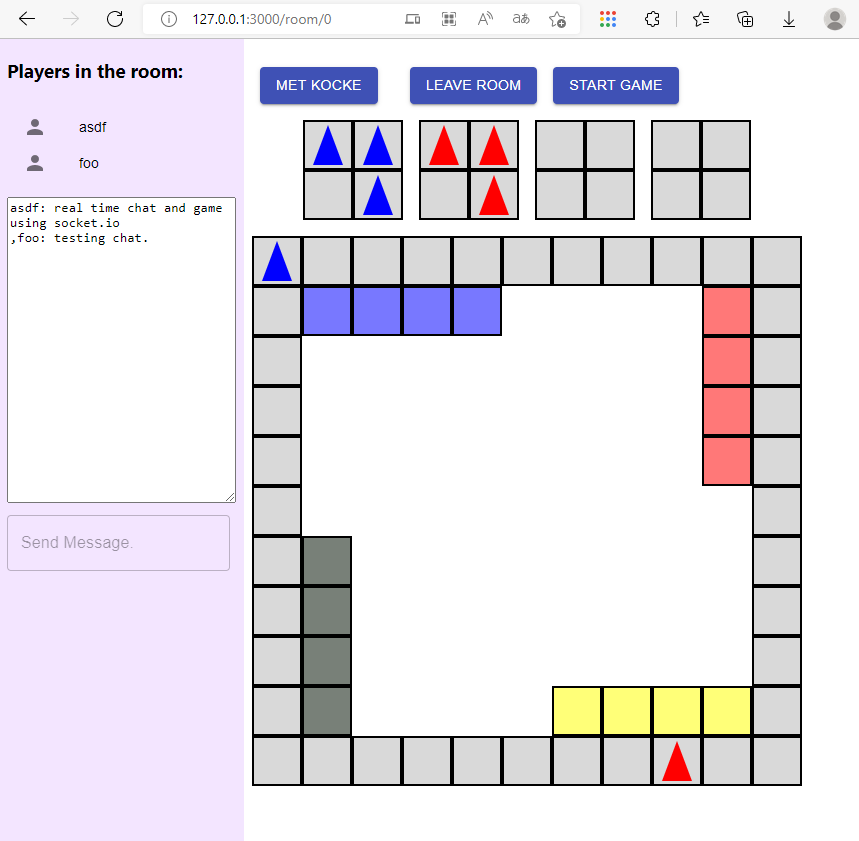

# ludo-webapp
ludo implementation with react frontend, and express backend using socket io and rooms with real time game and text chat.

## Usage
Start backend and frontend with...
```bash
npm install
npm start
```

## Preview


## License
[MIT](https://choosealicense.com/licenses/mit/)